# FDFED React - ER Diagrams & Wireframes

This document contains Entity-Relationship diagrams for the database schemas and wireframe diagrams for the application routing structure. All diagrams are in Mermaid format and can be converted to images using any Mermaid-compatible renderer.

---

## 1. Database Entity-Relationship Diagram

### Complete ER Diagram

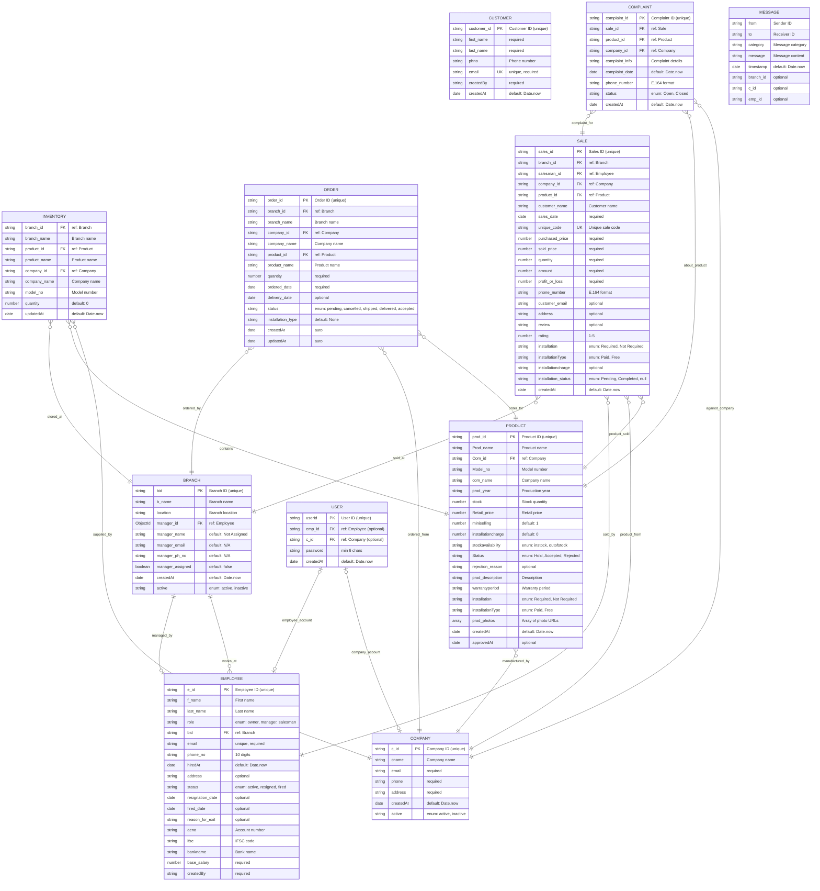

---

## 2. Simplified ER Diagram (Core Relationships)

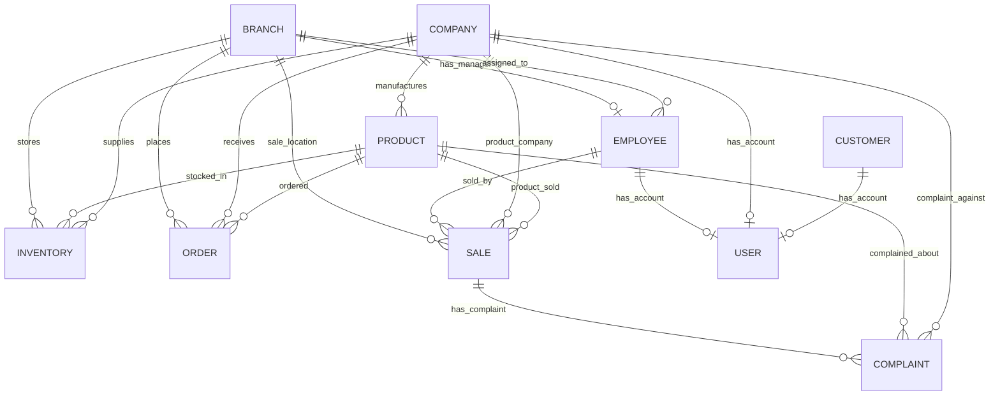

---

## 3. Application Wireframe - Routing Structure

### 3.1 Complete Application Flow

```mermaid
flowchart TB
    subgraph PUBLIC["🌐 Public Routes"]
        HOME["/  HomePage"]
        NEW["/newproducts  NewProducts"]
        OUR["/ourproducts  OurProducts"]
        TOP["/topproducts  TopProducts"]
        BRANCHES["/our-branches  OurBranches"]
        ABOUT["/about-us  AboutUs"]
        CONTACT["/contact-us  ContactUs"]
        LOGIN["/login  LoginPage"]
        CLOGIN["/companylogin  CompanyLogin"]
        CUSLOGIN["/customerlogin  CustomerLoginPage"]
        FORGOT["/forgot-password  ForgotPassword"]
    end

    subgraph AUTH["🔐 Authentication"]
        DASHBOARD["/dashboard  PostLoginRedirect"]
    end

    subgraph OWNER["👑 Owner Routes"]
        O_ANALYTICS["/owner/analytics"]
        O_EMPLOYEES["/owner/employees"]
        O_COMPANIES["/owner/companies"]
        O_BRANCHES["/owner/branches"]
        O_PRODUCTS["/owner/products"]
        O_SALES["/owner/sales"]
        O_ORDERS["/owner/orders"]
        O_INVENTORY["/owner/inventory"]
        O_SALARIES["/owner/salaries"]
        O_PROFITS["/owner/profits"]
        O_MESSAGES["/owner/messages"]
    end

    subgraph MANAGER["👔 Manager Routes"]
        M_EMPLOYEES["/manager/employees"]
        M_EMP_DETAIL["/manager/employees/:e_id"]
        M_PROFILE["/manager/profile"]
        M_ORDERS["/manager/orders"]
        M_ORDER_DETAIL["/manager/orders/:id"]
        M_INVENTORY["/manager/inventory"]
        M_SALES["/manager/sales"]
        M_SALARY["/manager/salary"]
        M_ANALYTICS["/manager/analytics"]
        M_MESSAGES["/manager/messages"]
    end

    subgraph SALESMAN["🛒 Salesman Routes"]
        S_ANALYTICS["/salesman/analytics"]
        S_PROFILE["/salesman/profile"]
        S_SALES["/salesman/sales/*"]
        S_INVENTORY["/salesman/inventory"]
        S_SALARIES["/salesman/salaries"]
        S_MESSAGES["/salesman/messages"]
    end

    subgraph COMPANY["🏢 Company Routes"]
        C_ANALYTICS["/company/analytics"]
        C_PRODUCTS["/company/products"]
        C_ORDERS["/company/orders"]
        C_COMPLAINTS["/company/complaints"]
        C_SALES["/company/sales"]
        C_SALE_DETAIL["/company/sales/:id"]
        C_MESSAGES["/company/messages"]
    end

    subgraph CUSTOMER["👤 Customer Routes"]
        CU_PURCHASES["/customer/previouspurchases"]
        CU_COMPLAINTS["/customer/complaints"]
        CU_REVIEW["/customer/review"]
        CU_BLOGS["/customer/blogs"]
    end

    subgraph ERROR["⚠️ Error"]
        NOTFOUND["* NotFoundPage"]
    end

    LOGIN --> DASHBOARD
    CLOGIN --> DASHBOARD
    CUSLOGIN --> DASHBOARD

    DASHBOARD -->|owner| O_ANALYTICS
    DASHBOARD -->|manager| M_ANALYTICS
    DASHBOARD -->|salesman| S_ANALYTICS
    DASHBOARD -->|company| C_ANALYTICS
    DASHBOARD -->|customer| CU_PURCHASES
```

---

### 3.2 Public Routes Wireframe

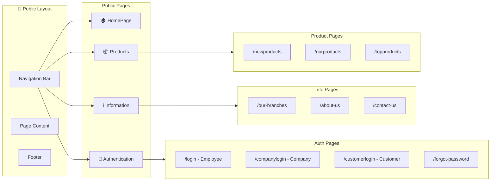

---

### 3.3 Owner Dashboard Wireframe

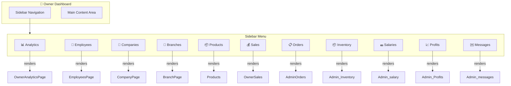

---

### 3.4 Manager Dashboard Wireframe

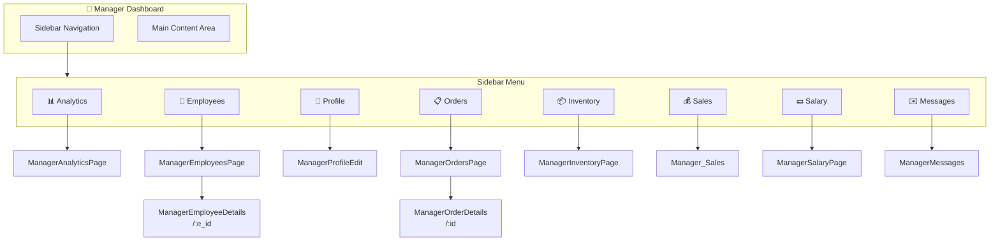

---

### 3.5 Salesman Dashboard Wireframe

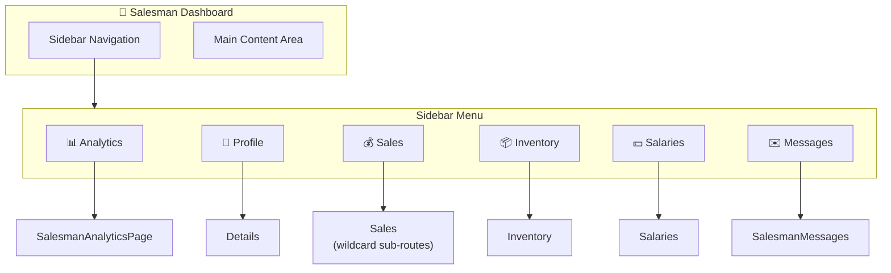

---

### 3.6 Company Dashboard Wireframe

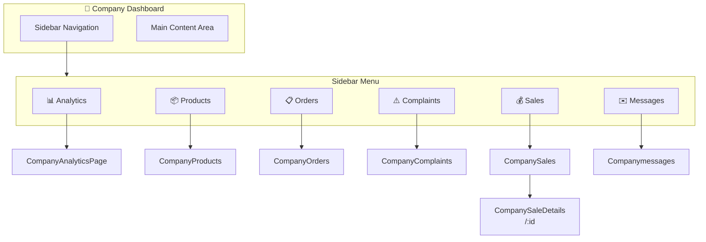

---

### 3.7 Customer Dashboard Wireframe

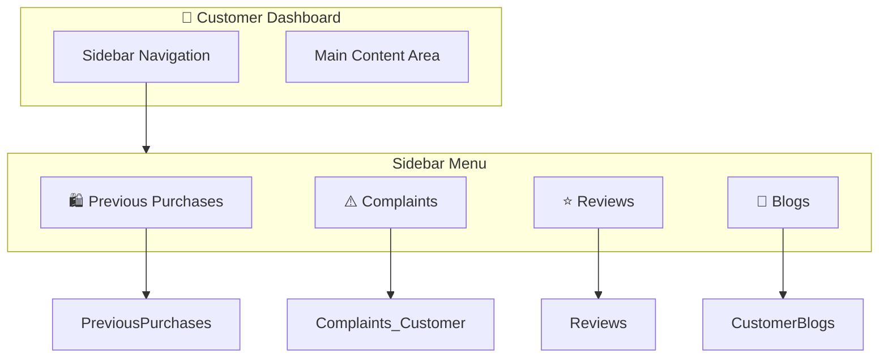

---

## 4. Data Flow Diagrams

### 4.1 Order Flow

```mermaid
flowchart LR
    subgraph Manager["Manager"]
        M_CREATE["Create Order"]
    end

    subgraph System["System"]
        ORDER["Order Created\n(status: pending)"]
        NOTIFY["Notify Company"]
    end

    subgraph Company["Company"]
        C_VIEW["View Order"]
        C_ACCEPT["Accept Order"]
        C_SHIP["Ship Order"]
        C_DELIVER["Mark Delivered"]
    end

    subgraph Branch["Branch"]
        B_ACCEPT["Accept Delivery"]
        INV_UPDATE["Update Inventory"]
    end

    M_CREATE --> ORDER
    ORDER --> NOTIFY
    NOTIFY --> C_VIEW
    C_VIEW --> C_ACCEPT
    C_ACCEPT -->|status: accepted| C_SHIP
    C_SHIP -->|status: shipped| C_DELIVER
    C_DELIVER -->|status: delivered| B_ACCEPT
    B_ACCEPT -->|status: accepted| INV_UPDATE
```

---

### 4.2 Sales Flow

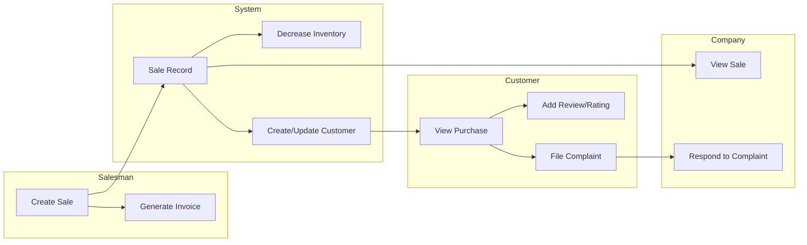

---

### 4.3 Product Approval Flow

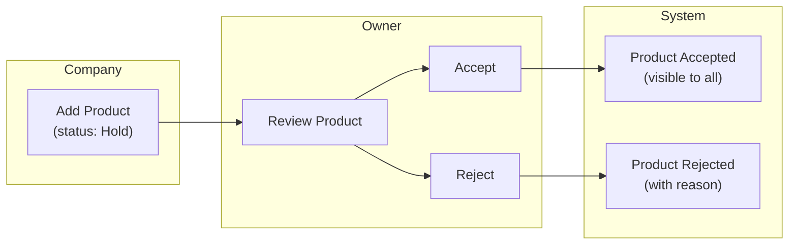

---

## 5. Schema Context & Relationships Summary

### Entity Relationships Table

| Parent Entity | Child Entity | Relationship | Foreign Key |
|--------------|--------------|--------------|-------------|
| **Branch** | Employee | One-to-Many | `Employee.bid` |
| **Branch** | Inventory | One-to-Many | `Inventory.branch_id` |
| **Branch** | Order | One-to-Many | `Order.branch_id` |
| **Branch** | Sale | One-to-Many | `Sale.branch_id` |
| **Company** | Product | One-to-Many | `Product.Com_id` |
| **Company** | Inventory | One-to-Many | `Inventory.company_id` |
| **Company** | Order | One-to-Many | `Order.company_id` |
| **Company** | Sale | One-to-Many | `Sale.company_id` |
| **Company** | Complaint | One-to-Many | `Complaint.company_id` |
| **Company** | User | One-to-One | `User.c_id` |
| **Product** | Inventory | One-to-Many | `Inventory.product_id` |
| **Product** | Order | One-to-Many | `Order.product_id` |
| **Product** | Sale | One-to-Many | `Sale.product_id` |
| **Product** | Complaint | One-to-Many | `Complaint.product_id` |
| **Employee** | Branch | One-to-One (Manager) | `Branch.manager_id` |
| **Employee** | Sale | One-to-Many | `Sale.salesman_id` |
| **Employee** | User | One-to-One | `User.emp_id` |
| **Sale** | Complaint | One-to-Many | `Complaint.sale_id` |

### Cardinality Notation
- `||--||` : One-to-One
- `||--o{` : One-to-Many (optional)
- `}o--||` : Many-to-One

---

## 6. How to Convert to Images

### Using Mermaid Live Editor
1. Go to [mermaid.live](https://mermaid.live)
2. Copy any Mermaid code block (between ```mermaid and ```)
3. Paste into the editor
4. Download as PNG/SVG

### Using VS Code Extensions
1. Install "Markdown Preview Mermaid Support" extension
2. Open this file in VS Code
3. Preview with `Ctrl+Shift+V`
4. Right-click diagrams to save as images

### Using CLI (mermaid-cli)
```bash
npm install -g @mermaid-js/mermaid-cli
mmdc -i ER_Diagrams_and_Wireframes.md -o output.png
```

### Using GitHub
GitHub automatically renders Mermaid diagrams in markdown files. Just push this file to your repository.

---

## 7. Quick Reference - All Schemas

| Schema | Primary Key | Main References |
|--------|-------------|-----------------|
| Branch | `bid` | → Employee (manager) |
| Company | `c_id` | - |
| Complaint | `complaint_id` | → Sale, Product, Company |
| Customer | `customer_id` | - |
| Employee | `e_id` | → Branch |
| Inventory | Compound (`branch_id`, `product_id`, `company_id`) | → Branch, Product, Company |
| Message | - | → Branch, Company, Employee (optional) |
| Order | `order_id` | → Branch, Company, Product |
| Product | `prod_id` | → Company |
| Sale | `sales_id` | → Branch, Employee, Company, Product |
| User | `userId` | → Employee OR Company |
